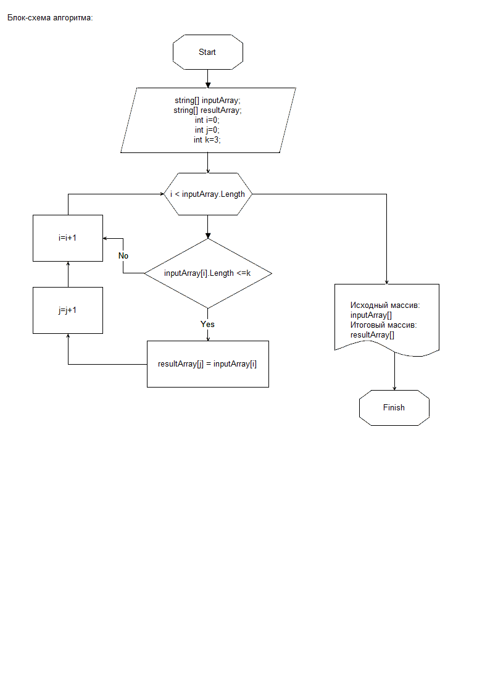

# Итоговая работа для проверки знаний по Блоку 1

## Задание

1. Создать репозиторий на GitHub
2. Нарисовать блок-схему алгоритма (можно обойтись блок-схемой основной содержательной части, если вы выделяете её в отдельный метод)
3. Снабдить репозиторий оформленным текстовым описанием решения (файл README.md)
4. Написать программу, решающую поставленную задачу
5. Использовать контроль версий в работе над этим небольшим проектом (не должно быть так, что всё залито одним коммитом, как минимум этапы 2, 3, и 4 должны быть расположены в разных коммитах).

**Задача:**

Написать программу, которая из имеющегося массива строк формирует новый массив из строк, длина которых меньше, либо равна 3 символам. Первоначальный массив можно ввести с клавиатуры, либо задать на старте выполнения алгоритма. При решении не рекомендуется пользоваться коллекциями, лучше обойтись исключительно массивами.

    **Примеры:**

    [“Hello”, “2”, “world”, “:-)”] → [“2”, “:-)”]

    [“1234”, “1567”, “-2”, “computer science”] → [“-2”]

    [“Russia”, “Denmark”, “Kazan”] → []

## Решение

1. На GitHub создан репозиторий "AndreyevaNi/FinalWork_Block1", ссылка на работу на [GitHub](https://github.com/AndreyevaNi/FinalWork_Block1).

2. Описание алгоритма решения и блок-схема

    **Описание алгоритма**

    1. В исходном массиве выполняется перебор значений и выполняется проверка каждого значение элемента массива 
    на соответствие условию длина строки меньше или равна трем символам.
    2. Если заданное значение удовлетворяет условию, то  помещаем значение в новый массив.
    3. Пункты 1 и 2 повторяются в цикле  до тех пор,  пока не будет достигнут конец массива.
    4. В результате будет возвращен массив строк, длина которых меньше либо равна трем символам.

    **Блок-схема**

    

3. Описание рещения содержится в файле README.md.

4. Программа написана на C# см. каталог Task1 (Program.cs).

